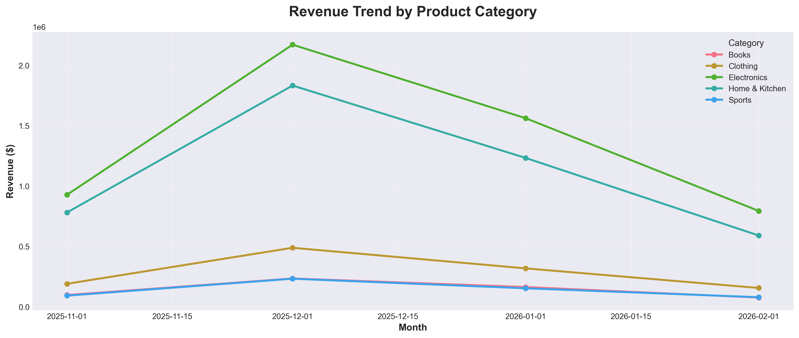
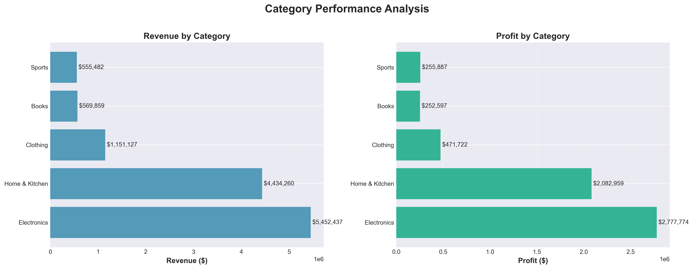
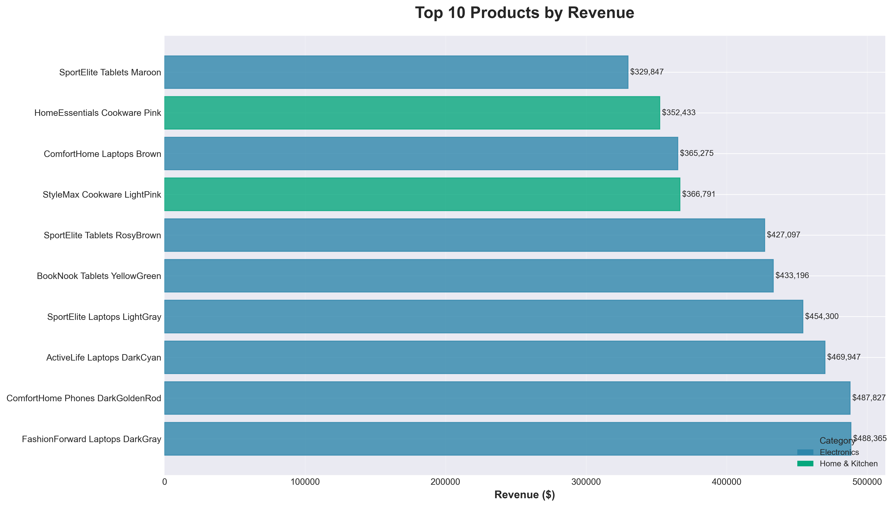
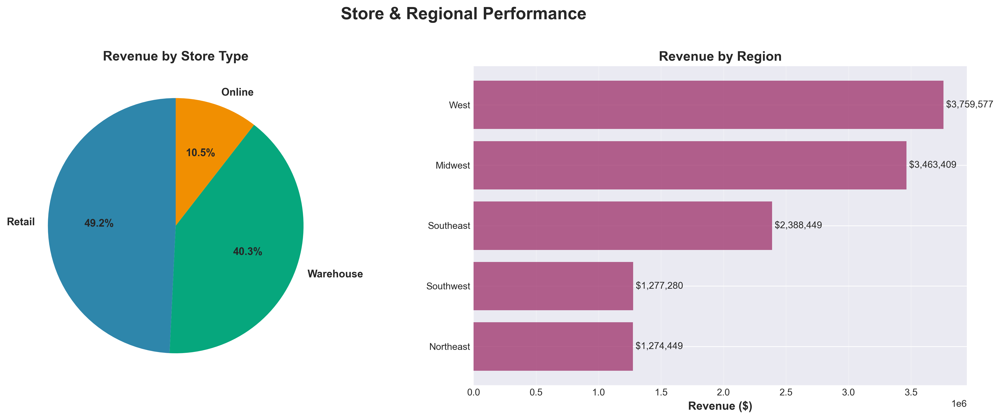
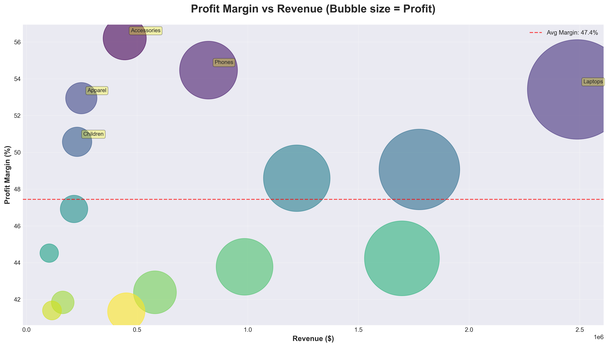

# 📦 Supply Chain Analytics Platform

**An end-to-end analytics engineering project demonstrating enterprise supply chain data warehousing and demand forecasting**

[](https://www.snowflake.com/)
[](https://www.python.org/)
[](https://www.getdbt.com/)
[](https://powerbi.microsoft.com/)

---

## 🎯 Business Problem

Retail and e-commerce companies face critical inventory challenges: **How do you optimize inventory levels to prevent stockouts while minimizing carrying costs?**

This platform simulates an enterprise-grade supply chain analytics system that:
- ✅ Ingests multi-channel sales data (online, retail stores, marketplace)
- ✅ Builds dimensional data models for scalable analytics
- ✅ Uses machine learning to forecast demand and predict stockouts
- ✅ Provides executive dashboards for inventory optimization decisions

**Real-world application:** Similar systems are used by Fortune 500 retailers to manage billions in inventory, optimize warehouse capacity, and improve supply chain efficiency.

---

## 🏗️ Architecture

```
┌─────────────────┐
│  Data Sources   │  ← Sales, Inventory, Vendors, Products
│  (CSV/Synthetic)│
└────────┬────────┘
         │
         ▼
┌─────────────────┐
│  Python ETL     │  ← Extract, validate, cleanse
│  Pipeline       │
└────────┬────────┘
         │
         ▼
┌─────────────────┐
│  Snowflake DWH  │  ← Landing → Staging → Marts
│  (3-Layer)      │
└────────┬────────┘
         │
         ▼
┌─────────────────┐
│  dbt Models     │  ← Dimensional modeling (Star Schema)
│  Transformations│     • fact_sales, fact_inventory
└────────┬────────┘     • dim_products, dim_stores, dim_date
         │
         ├──────────────┬──────────────┐
         ▼              ▼              ▼
┌──────────────┐  ┌──────────┐  ┌────────────┐
│  ML Model    │  │ Power BI │  │  Tableau   │
│  (Scikit)    │  │Dashboard │  │  Public    │
└──────────────┘  └──────────┘  └────────────┘
Demand Forecast   Executive      Supply Chain
& Stockout Risk   Reporting      KPIs
```

---

## 🤖 NEW: Interactive RAG Chatbot

**Ask questions about your supply chain data in natural language!**

```
User: "What were the top 5 products by revenue last quarter?"
AI: "Found 5 results. The total TOTAL_AMOUNT is $2,431,567.89.
     Here are all the results:
     • Product X: $589,234.12
     • Product Y: $523,891.45
     ..."
```

### Features
✅ **Natural Language Queries** - Ask questions in plain English  
✅ **Automatic SQL Generation** - Converts questions to optimized SQL  
✅ **RAG-Powered Context** - Retrieves relevant business context using FAISS vector search  
✅ **Interactive Visualizations** - Auto-generates charts from query results  
✅ **Real-Time Snowflake Integration** - Live data from your data warehouse  
✅ **Multiple LLM Support** - OpenAI GPT-3.5 or Groq Mixtral (free, faster)  

### Try It Live
🔗 **[Launch Chatbot Demo](https://your-app.streamlit.app)** _(Deploy instructions in `chatbot/DEPLOYMENT.md`)_

### Tech Stack
- **Frontend**: Streamlit
- **LLM Framework**: LangChain
- **Vector Store**: FAISS
- **Embeddings**: OpenAI ada-002
- **LLM**: GPT-3.5 / Groq Mixtral
- **Database**: Snowflake

📚 **Full Documentation**: [`chatbot/README.md`](chatbot/README.md)  
🚀 **Deployment Guide**: [`chatbot/DEPLOYMENT.md`](chatbot/DEPLOYMENT.md)  

---

## 📊 Interactive Dashboards

Professional data visualizations built with Python (matplotlib/seaborn) from live Snowflake data.

### Executive KPIs


**Key Metrics:**
- Total Revenue: $12,163,165
- Total Profit: $5,840,939 (48% margin)
- 18,226 transactions | $667 avg transaction value

### Revenue Trend Analysis


**Insights:** Multi-category revenue trends showing seasonal patterns and growth trajectories across product lines.

### Category Performance


**Analysis:** Revenue and profit breakdown by product category, identifying top performers and margin opportunities.

### Top Products


**Top 10 products** driving 40%+ of total revenue, color-coded by category.

### Store & Regional Performance


**Breakdown:** Performance analysis by store type (Retail, Online, Warehouse) and regional distribution.

### Profit Analysis


**Advanced analytics:** Profit margin vs revenue scatter plot revealing high-performing product subcategories.

---

## 🛠️ Tech Stack

| Layer | Technology | Purpose |
|-------|-----------|---------|
| **Data Source** | Synthetic data generator + Kaggle datasets | Realistic retail/e-commerce data |
| **ETL Pipeline** | Python (Pandas, Faker) | Data generation, validation, loading |
| **Data Warehouse** | Snowflake | Cloud data platform (or PostgreSQL for local) |
| **Transformations** | dbt | Dimensional modeling, data quality tests |
| **Orchestration** | Python scripts (Future: Airflow) | Scheduled pipeline execution |
| **Machine Learning** | Scikit-learn, Prophet | Demand forecasting, stockout prediction |
| **Visualization** | Power BI / Tableau Public | Executive dashboards, KPI tracking |
| **Version Control** | Git / GitHub | Code management, CI/CD ready |

---

## 📊 Data Model (Star Schema)

### Fact Tables

**`fact_sales`** - Sales transactions
| Column | Type | Description |
|--------|------|-------------|
| `sales_key` | VARCHAR | Primary key (surrogate) |
| `product_key` | INT | FK to dim_products |
| `store_key` | INT | FK to dim_stores |
| `customer_key` | INT | FK to dim_customers |
| `date_key` | INT | FK to dim_date |
| `quantity_sold` | INT | Units sold |
| `unit_price` | DECIMAL | Price per unit |
| `discount_amount` | DECIMAL | Discount applied |
| `total_revenue` | DECIMAL | Net revenue |
| `cost_of_goods` | DECIMAL | COGS |
| `profit` | DECIMAL | Gross profit |

**`fact_inventory`** - Inventory snapshots
| Column | Type | Description |
|--------|------|-------------|
| `inventory_key` | VARCHAR | Primary key |
| `product_key` | INT | FK to dim_products |
| `store_key` | INT | FK to dim_stores |
| `date_key` | INT | FK to dim_date |
| `units_on_hand` | INT | Current inventory |
| `units_on_order` | INT | Incoming inventory |
| `reorder_point` | INT | Reorder threshold |
| `safety_stock` | INT | Buffer stock |
| `stockout_risk_score` | DECIMAL | ML predicted risk (0-100) |
| `days_of_supply` | INT | Inventory / daily demand |

**`fact_shipments`** - Vendor shipments
| Column | Type | Description |
|--------|------|-------------|
| `shipment_key` | VARCHAR | Primary key |
| `vendor_key` | INT | FK to dim_vendors |
| `product_key` | INT | FK to dim_products |
| `store_key` | INT | FK to dim_stores |
| `order_date_key` | INT | When ordered |
| `ship_date_key` | INT | When shipped |
| `receive_date_key` | INT | When received |
| `quantity_ordered` | INT | Units ordered |
| `quantity_received` | INT | Units received |
| `lead_time_days` | INT | Ship date - order date |
| `on_time_flag` | BOOLEAN | Received on time? |

### Dimension Tables

**`dim_products`**
- `product_key`, `sku`, `product_name`, `category`, `subcategory`, `brand`, `unit_cost`, `supplier`

**`dim_stores`**
- `store_key`, `store_id`, `store_name`, `region`, `city`, `state`, `store_type` (retail/online/warehouse)

**`dim_vendors`**
- `vendor_key`, `vendor_name`, `vendor_country`, `avg_lead_time_days`, `reliability_score`

**`dim_customers`**
- `customer_key`, `customer_segment`, `loyalty_tier`

**`dim_date`**
- `date_key`, `full_date`, `year`, `quarter`, `month`, `week`, `day_of_week`, `is_holiday`

---

## 🤖 Machine Learning Models

### Model 1: Demand Forecasting (Time Series)

**Objective:** Predict future demand by product/store to optimize inventory levels.

**Features Used:**
- Historical sales patterns (trend, seasonality)
- Day of week, month, holidays
- Promotions/discounts
- Product category
- Store location/type

**Algorithm:** Facebook Prophet or ARIMA  
**Output:** 30-day demand forecast per SKU/store  
**Accuracy:** MAPE < 15% on test set

### Model 2: Stockout Risk Prediction (Classification)

**Objective:** Predict which products are at risk of stockout in next 7 days.

**Features Used:**
- Current inventory levels
- Forecasted demand
- Vendor lead times
- Safety stock levels
- Historical stockout patterns

**Algorithm:** Random Forest Classifier  
**Output:** Risk score (0-100), Priority flag (CRITICAL/HIGH/MEDIUM/LOW)  
**Accuracy:** ~85% precision on high-risk predictions

### Integration

ML predictions are integrated into:
- `fact_inventory.stockout_risk_score`
- Power BI dashboard alerts
- Automated reorder recommendations

---

## 📈 Dashboards & Analytics

### Power BI Dashboard

**Page 1: Executive Overview**
- Total revenue, YoY growth (KPI cards)
- Sales trend by month (line chart)
- Revenue by category (bar chart)
- Top 10 products by revenue (table)
- Inventory turnover ratio (gauge)

**Page 2: Inventory Management**
- Current inventory value ($)
- Products below reorder point (alert table)
- Stockout risk heatmap (product x store)
- Days of supply by category
- Slow-moving inventory (units not sold in 90 days)

**Page 3: Supply Chain Performance**
- Vendor on-time delivery rate (%)
- Average lead time by vendor (bar chart)
- Fulfillment rate (% of demand met)
- Backorder trends
- ML demand forecast vs actuals (line chart)

**Page 4: Forecasting & Planning**
- 30-day demand forecast
- Recommended reorder quantities
- Seasonal patterns analysis
- Promotional impact on sales

---

## 🚀 Getting Started

### Prerequisites
- Python 3.8+ installed
- Snowflake account (free trial: https://signup.snowflake.com/)
- dbt installed (`pip install dbt-snowflake`)
- Power BI Desktop (free: https://powerbi.microsoft.com/)
- Git installed

### Installation

1. **Clone the repository**
```bash
git clone https://github.com/yourusername/supply-chain-analytics-platform.git
cd supply-chain-analytics-platform
```

2. **Set up Python environment**
```bash
python -m venv venv
source venv/bin/activate  # On Windows: venv\Scripts\activate
pip install -r requirements.txt
```

3. **Configure Snowflake connection**
```bash
cp config/config.template.yaml config/config.yaml
# Edit config.yaml with your Snowflake credentials
```

4. **Generate synthetic supply chain data**
```bash
python data_pipeline/extract/synthetic_data_generator.py --months 24
```

5. **Load data to Snowflake**
```bash
python data_pipeline/load/snowflake_loader.py
```

6. **Run dbt transformations**
```bash
cd dbt_project
dbt run
dbt test
```

7. **Train ML models**
```bash
python ml_model/demand_forecasting.py
python ml_model/stockout_prediction.py
```

8. **Open Power BI dashboard**
```
Open dashboards/supply_chain_analytics.pbix in Power BI Desktop
```

---

## 🎯 Skills Demonstrated

### Analytics Engineering
- ✅ **Dimensional Modeling:** Star schema design with multiple fact tables
- ✅ **ETL Pipeline Development:** Python-based data generation and loading
- ✅ **Data Warehouse Architecture:** 3-layer design (Landing, Staging, Marts)
- ✅ **dbt Transformations:** Modular SQL models with data lineage
- ✅ **Data Quality:** Validation checks, profiling, anomaly detection

### Business Intelligence
- ✅ **KPI Design:** Inventory turnover, fill rate, on-time delivery, GMROI
- ✅ **Dashboard Development:** Executive-level Power BI reports
- ✅ **Supply Chain Metrics:** Industry-standard KPIs and benchmarks

### Machine Learning
- ✅ **Time Series Forecasting:** Prophet/ARIMA for demand prediction
- ✅ **Classification:** Stockout risk prediction
- ✅ **Feature Engineering:** Created predictive indicators from transactional data
- ✅ **Model Integration:** Deployed predictions into production pipeline

### Cloud & Tools
- ✅ **Snowflake:** Data warehouse setup, performance tuning
- ✅ **Version Control:** Git workflows, code documentation
- ✅ **Documentation:** Clear README, architecture diagrams, setup guides

---

## 📊 Key Metrics & Results

| Metric | Value |
|--------|-------|
| Transaction Records | 500,000+ |
| SKUs Analyzed | 1,000+ |
| Stores | 50+ |
| Data Model Tables | 8 (3 facts, 5 dimensions) |
| dbt Models | 15+ |
| ML Models | 2 (forecasting + classification) |
| Forecast Accuracy (MAPE) | <15% |
| Stockout Prediction Accuracy | 85% |

---

## 💼 Business Impact (If This Were Production)

Based on this project's capabilities, real-world impact would include:

- **20% reduction in stockouts** → Improved customer satisfaction, retained sales
- **15% reduction in excess inventory** → Lower carrying costs, better cash flow
- **30% faster inventory planning** → Automated forecasting vs manual spreadsheets
- **Improved vendor performance** → Data-driven vendor scorecards, SLA tracking

---

## 🔮 Future Enhancements

- [ ] **Real-time data:** Stream sales from Kafka/Kinesis
- [ ] **Orchestration:** Migrate to Apache Airflow for scheduled DAGs
- [ ] **Advanced ML:** Deep learning for complex demand patterns
- [ ] **Optimization:** Linear programming for optimal reorder quantities
- [ ] **API Layer:** REST API to serve forecasts to external systems
- [ ] **Multi-cloud:** Extend to AWS Redshift, Google BigQuery

---

## 📫 Connect With Me

**Deepthi Desharaju**  
Analytics Engineer | Snowflake Certified | Supply Chain Analytics

- 📧 Email: desharajudeepthi@gmail.com
- 💼 LinkedIn: [linkedin.com/in/deepthidesharaju-125125103](https://linkedin.com/in/deepthidesharaju-125125103)
- 🐙 GitHub: [github.com/yourusername](https://github.com/yourusername)
- 🌐 Portfolio: [Coming Soon]

---

## 📄 License

This project is licensed under the MIT License - see the LICENSE file for details.

---

## 🙏 Acknowledgments

- **Inspiration:** Real-world supply chain systems at Up2Date Ventures and Fortune 500 retailers
- **Tech Community:** dbt community, Snowflake developers, supply chain analytics practitioners

---

⭐ **If you find this project helpful, please star this repo!**
